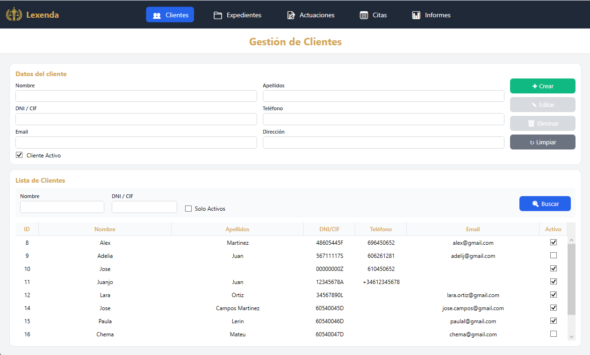
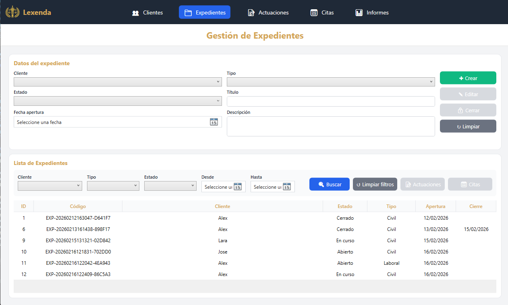
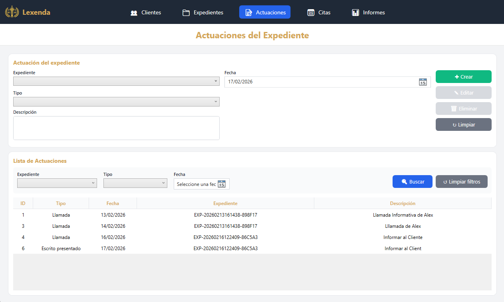
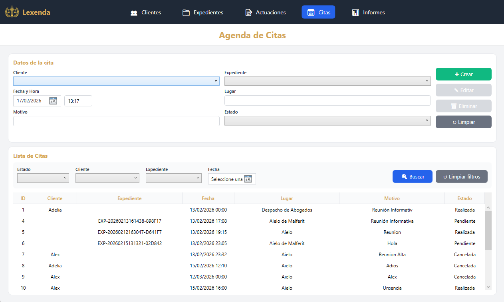
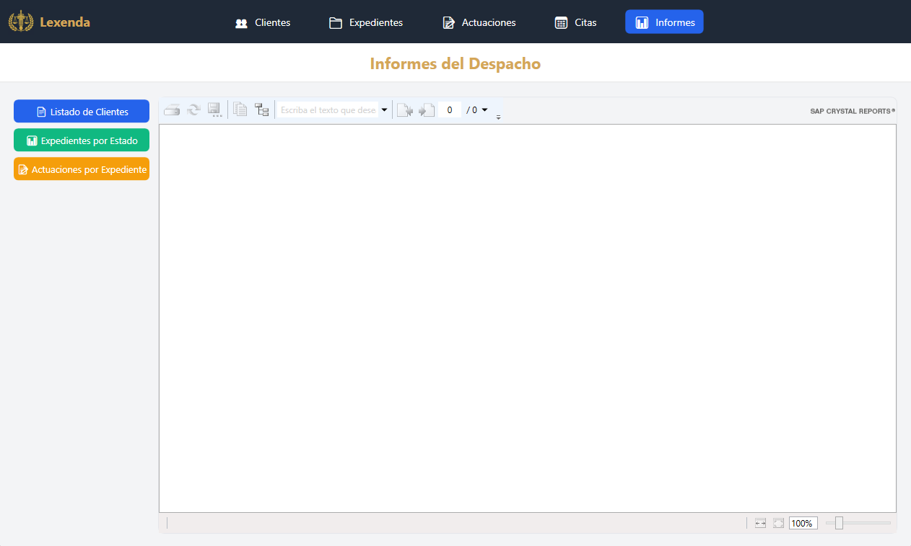

# ⚖️Lexenda - Sistema de Gestión de Despacho de Abogados

Sistema de escritorio desarrollado en WPF que permite gestionar de forma eficiente clientes, expedientes, actuaciones, citas e informes de un despacho de abogados, con generación de reportes profesionales mediante Crystal Reports.


## 📋 Descripción del Proyecto

**Lexenda** es una aplicación de escritorio que implementa el patrón arquitectónico **MVVM** (Model-View-ViewModel) para la gestión integral de un despacho de abogados. La aplicación permite:

- ✅ **Gestión de Cliente**: Registro, edición y desactivación de clientes con validación de DNI, email y teléfono
- ✅ **Gestión de Expedientes**: Administración de casos jurídicos con estados, tipos y seguimiento
- ✅ **Gestión de Actuaciones**: Registro de acciones realizadas en cada expediente
- ✅ **Gestión de Citas**: Sistema de agenda con validación de conflictos y fechas
- ✅ **Generación de Informes**: Reportes profesionales en Crystal Reports
- ✅ **Validaciones en tiempo real**: Control de datos y restricciones de negocio
- ✅ **Interfaz intuitiva**: Diseño moderno y fácil de usar

### 🎯 Características principales

- **Patrón MVVM**: Separación completa entre lógica de negocio y presentación
- **Data Binding**: Actualización automática de la interfaz
- **Commands**: Desacoplamiento de eventos mediante ICommand
- **Entity Framework 6**: Acceso a datos con ORM (Database First)
- **Validaciones**: Control de DNI español, emails, teléfonos y restricciones de integridad
- **Servicios**: Arquitectura en capas con Repository Pattern
- **Pruebas unitarias**: Tests con MSTest para validaciones críticas
- **Navegación inteligente**: Navegación directa desde expedientes a actuaciones y citas

---

## 🛠️ Tecnologías Utilizadas

### **Framework y Lenguajes**
- **.NET Framework 4.8**
- **C#**
- **WPF** (Windows Presentation Foundation)
- **XAML** para diseño de interfaces

### **Arquitectura y Patrones**
- **Patrón MVVM** (Model-View-ViewModel)
- **Repository Pattern** para acceso de datos
- **Service Layer** para lógica de negocio
- **INotifyPropertyChanged** para notificaciones de cambios
- **ICommand** para manejo de comandos

### **Acceso a Datos**
- **Entity Framework 6** (Database First)
- **SQL Server** como motor de base de datos
- **LINQ to Entities** para consultas

### **Generación de Informes**
- **SAP Crystal Reports** para .NET Framework
- **CrystalReportsViewer** para visualización
- **DataSets tipados** para fuente de datos

### **Pruebas**
- **MSTest** para pruebas unitarias y de integración
- Tests de validación de emails, teléfonos y conflictos de citas

### **Control de versiones**
- **Git** y **GitHub**

---


## 📦 Instalación

### **Requisitos previos**

Antes de instalar la aplicación, asegúrese de cumplir con los siguientes requisitos:

1. **Sistema operativo**: Windows 10 o superior
2. **Componentes necesarios**:
   - **.NET Framework 4.8** o superior
   - **SQL Server**
   - **Crystal Reports Runtime** para .NET Framework

---

### **Opción 1: Instalación mediante ClickOnce (Recomendada para usuarios finales)**

#### **Pasos para el administrador del sistema:**

1. **Publicar la aplicación desde Visual Studio**:
   - Abra el proyecto en Visual Studio 2022 o superior
   - Cambia la solución a Release (arriba, desplegable Debug → Release).
   - Haga clic derecho sobre el proyecto `SistemaGestionDespacho.View`
   - Seleccione **"Publicar"** (Publish)

2. **Configurar el método de publicación**:
   - Seleccione **ClickOnce** como método de publicación
   - Elija la ubicación de instalación

3. **Configurar opciones de instalación**:
   - **Modo de instalación**: Online o Offline
   - **Actualizaciones**: Automáticas o manuales
   - **Requisitos previos**: Marque .NET Framework 4.8

4. **Generar el instalador**:
   - Haga clic en **"Finalizar"**
   - Visual Studio generará:
     - `setup.exe` (instalador)
     - Archivos de manifiesto
     - Archivos de la aplicación

#### **Pasos para el usuario final:**

1. **Acceder a la ubicación de instalación**:
   - Navegue a la carpeta compartida o sitio web configurado
   - Localice el archivo `setup.exe`

2. **Ejecutar el instalador**:
   - Haga doble clic en `setup.exe`
   - Si aparece un aviso de seguridad, haga clic en **"Instalar"**

3. **Completar la instalación**:
   - El instalador descargará e instalará automáticamente:
     - La aplicación
     - Las dependencias necesarias
   - Se creará un acceso directo en el escritorio y en el menú Inicio

4. **Iniciar la aplicación**:
   - Haga doble clic en el icono "Lexenda Abogados" del escritorio
   - O búsquela en el menú Inicio: **"Lexenda Abogados"**

---

### **Opción 2: Instalación manual (Para desarrolladores)**

#### **1. Clonar el repositorio**

```bash
git clone https://github.com/alexMartJu/DespachoAbogados_MVVM_WPF_NETFramework_CrystalReports.git
cd DespachoAbogados_MVVM_WPF_NETFramework_CrystalReports
```

#### **2. Configurar la base de datos**

1. **Crear la base de datos**:
   - Abra SQL Server Management Studio
   - Ejecute el script de creación de base de datos (ubicado en `/Database/CreateDatabase.sql`)
   - Esto creará la base de datos ` SistemaGestionDespacho` con las tablas:
     - `Clientes`
     - `Expedientes`
     - `EstadosExpediente`
     - `Actuaciones`
     - `Citas`

2. **Configurar la cadena de conexión**:
   - Abra los archivos `App.config` del proyecto
   - Modifique las cadenas de conexión según su configuración

#### **3. Restaurar paquetes NuGet**

#### **4. Compilar la solución**

#### **5. Ejecutar la aplicación**

---

## 🚀 Cómo Ejecutar

### **Ejecución normal**

1. **Localice el ejecutable**:
   - Si instaló con ClickOnce: Use el acceso directo del escritorio
   - Si está utilizando Visual Studio: clicar en Iniciar

2. **Inicie la aplicación**:
   - Haga doble clic en el icono
   - La aplicación verificará automáticamente la conexión a la base de datos

3. **Navegación inicial**:
   - Por defecto, se abre la sección **"Clientes"**
   - Use el menú superior para navegar entre secciones:
     - 👥 Clientes
     - 📁 Expedientes
     - 📝 Actuaciones
     - 📅 Citas
     - 📊 Informes

---

## 📸 Capturas de Pantalla

### **1. Ventana Principal - Gestión de Clientes**

> *Vista principal mostrando el listado de clientes con opciones de crear, editar y eliminar. Incluye validación de DNI español, emails y teléfonos. Control de estado activo/inactivo.*

---

### **2. Gestión de Expedientes**

> *Administración de expedientes jurídicos con estados (Abierto, En curso, Pendiente, Cerrado), tipos (Civil, Penal, Laboral, Administrativo, Familia) y seguimiento. Validación automática antes de cerrar expedientes sin actuaciones. Navegación directa a actuaciones y citas del expediente.*

---

### **3. Gestión de Actuaciones**

> *Registro de actuaciones de expedientes con tipos (Llamada, Reunión, Escrito presentado, Escrito recibido, Notificación, Gestión documental). Validación de expedientes cerrados. Filtros por expediente, tipo y fecha.*

---

### **4. Gestión de Citas**

> *Sistema de agenda con validación de conflictos horarios, estados (Pendiente, Realizada, Cancelada) y asociación a clientes o expedientes. Control de citas duplicadas.*

---

### **5. Selección de Informes**

> *Panel de selección de informes con tres opciones disponibles: Listado de clientes, Expedientes por estado e Actuaciones por expediente.*

---

## 🧪 Pruebas Unitarias y de Integración

El proyecto incluye pruebas unitarias y de integración con **MSTest** para validar la lógica crítica:

### **Ejecutar todas las pruebas**

Desde Visual Studio > Menú "Ver" > "Explorador de pruebas" > "Ejecutar todas las pruebas de la vista"

### **Pruebas incluidas**

#### **1. ClienteEmailTests** - Validación de formato de emails
#### **2. ClienteTelefonoTests** - Validación de teléfonos españoles
#### **3. CitaTests** - Control de conflictos horarios. Prueba de integración que verifica la restricción de citas duplicadas

---

## 🔒 Seguridad y Validaciones

### **Validaciones implementadas**

| Tipo | Descripción |
|------|-------------|
| **DNI único** | No permite DNI/CIF duplicados en la base de datos |
| **Formato DNI español** | Validación de 8 dígitos + letra |
| **Formato de email** | Validación con expresiones regulares |
| **Formato de teléfono** | Validación de 9 dígitos españoles (prefijo +34 opcional) |
| **Cliente activo** | No permite crear expedientes/citas para clientes desactivados |
| **Expediente cerrado** | No permite crear/editar actuaciones en expedientes cerrados |
| **Conflictos de citas** | Previene dos citas en la misma fecha/hora |
| **Integridad referencial** | No permite eliminar clientes con expedientes abiertos/en curso |
| **Cierre de expedientes** | Requiere al menos una actuación antes de cerrar |
| **Campos obligatorios** | Validación de campos requeridos antes de guardar |

### **Restricciones de base de datos**

- 🔑 **Claves primarias**: Identity en todos los IDs
- 🔗 **Claves foráneas**: Relaciones entre Clientes, Expedientes, Actuaciones, Citas y Estados
- 🚫 **Restricciones ON DELETE RESTRICT**: Control de eliminación según entidad
- ✅ **Índices únicos**: DNI_CIF en la tabla Clientes, Codigo en Expedientes

---

## 🤝 Contribuir

¡Las contribuciones son bienvenidas! Si desea mejorar este proyecto:

1. **Fork** el repositorio
2. Cree una **rama** para su feature (`git checkout -b feature/NuevaCaracteristica`)
3. **Commit** sus cambios (`git commit -m 'Añadir nueva característica'`)
4. **Push** a la rama (`git push origin feature/NuevaCaracteristica`)
5. Abra un **Pull Request**

### **Guías para contribuir**

- Siga el patrón MVVM establecido
- Mantenga la separación de capas
- Añada pruebas unitarias para nuevas funcionalidades
- Documente el código con comentarios XML
- Siga las convenciones de nomenclatura de C#

---

## 👨‍💻 Autores

### **Desarrollador Principal**

**Alex Martínez Juan**
- 💼 GitHub: [@alexMartJu](https://github.com/alexMartJu)

---

## 🌟 ¡Dale una estrella!

Si este proyecto te ha sido útil, considera darle una ⭐ en GitHub. ¡Gracias!

---